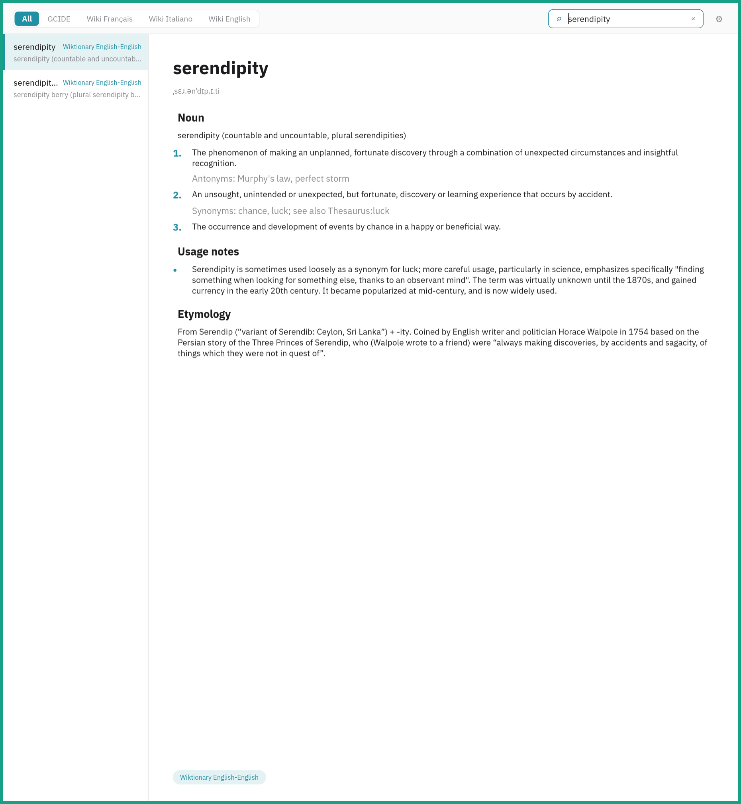
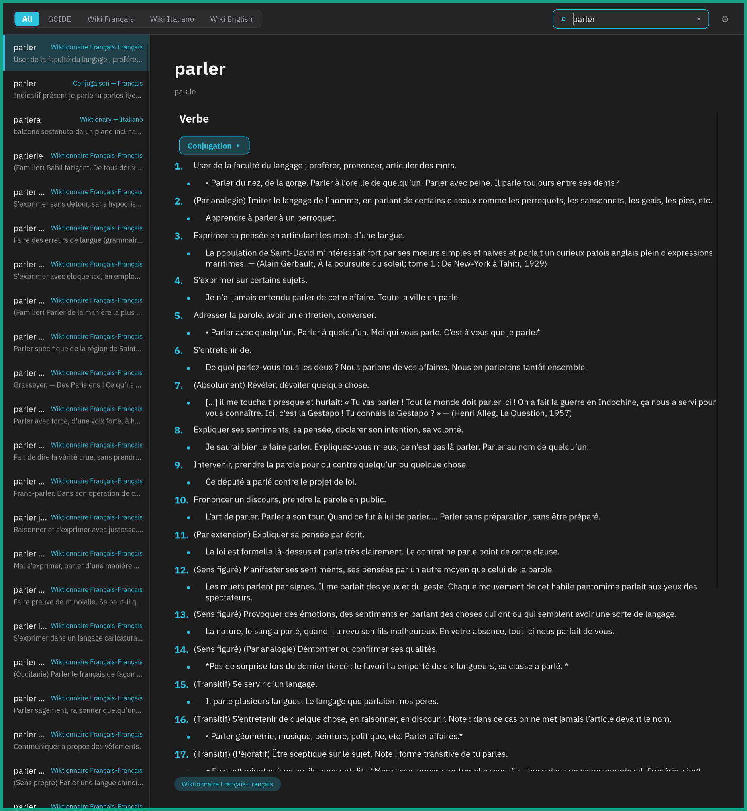

<div align="center">


# IronDict

**Fast local multi-dictionary lookup with fuzzy and full-text search — CLI and GUI.**

[](LICENSE)


<table>
<tr>
<td></td>
<td></td>
</tr>
</table>

</div>

## About

irondict is a desktop dictionary app written in Rust. It loads
[StarDict](https://en.wikipedia.org/wiki/StarDict) dictionaries and gives you
instant fuzzy and full-text search over all of them at once. The same lookup
engine powers two front-ends — a native GUI and a CLI — so you can search from
your desktop or your terminal.

The public-domain [GCIDE](docs/gcide.md) dictionary is bundled, so it works out
of the box; add your own StarDict dictionaries to search across them too.

## Features

- **Two front-ends, one engine** — a native [Slint](https://slint.dev) GUI and a
  clap-based CLI share the same core lookup library.
- **Fuzzy & full-text search** across every enabled dictionary at once.
- **Clickable cross-references** — follow links between entries in the GUI.
- **Bundled GCIDE** dictionary; add any StarDict dictionary you own.
- **System theme aware** (light/dark via the XDG desktop portal).

## Install

Build from source with a recent stable Rust toolchain:

```sh
git clone https://github.com/DrPandemic/irondict
cd irondict
cargo build --release
```

The binaries land in `target/release/`: `irondict-gui` and `irondict-cli`.

## Usage

### GUI

```sh
cargo run --release -p irondict-gui
```

### CLI

```sh
# Look up a word across all enabled dictionaries
irondict-cli lookup serendipity

# Full-text search
irondict-cli search "light shawl for the neck"

# Manage dictionaries
irondict-cli add /path/to/dictionary.ifo
irondict-cli list
irondict-cli remove "Dictionary Name"
```

## Configuration

Dictionaries and preferences are stored in `~/.config/irondict/config.toml`. The
search index is cached under `~/.cache/irondict/` and rebuilt automatically when
the dictionary set changes.

## License

[GPL-3.0-or-later](LICENSE).
